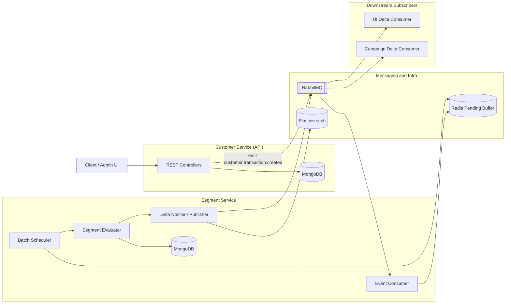
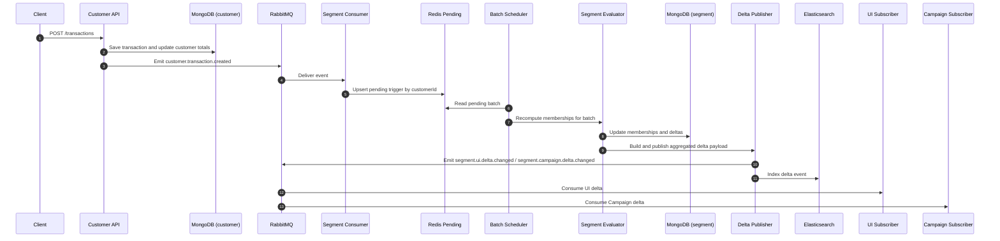
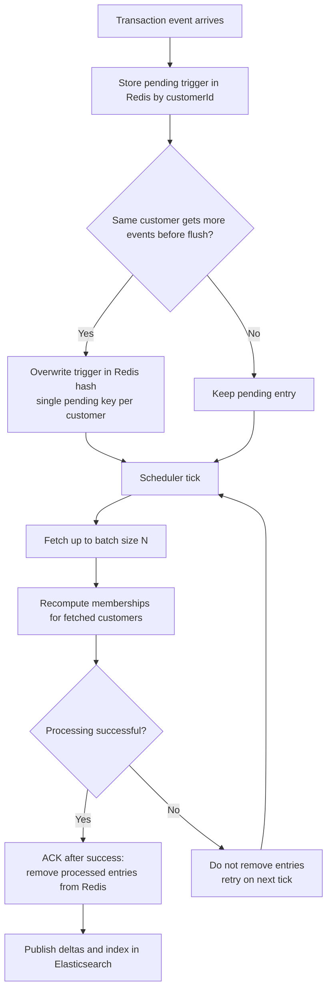

## Requirements

- Node.js 20+
- `pnpm`
- Docker Desktop (for container run)

## Run With Docker (recommended)

From project root (`drift-seg-api`):

```bash
docker compose up -d
```

- `docker compose up -d` - starts existing images in background.

If you changed code, dependencies, or Dockerfile:

```bash
docker compose up -d --build
```

- `docker compose up -d --build` - rebuilds images and starts containers.

Stop containers:

```bash
docker compose down
```

If dependencies changed and container keeps old modules (`node_modules` volume cache issue):

```bash
docker compose down -v
docker compose up -d --build
```

- `docker compose down -v` removes compose volumes.
- usually this is enough before trying global cleanup.

Advanced cleanup (use only if needed):

```bash
docker compose down --remove-orphans
docker system prune -f
```

- `--remove-orphans` removes stale containers not in current compose file.
- `docker system prune -f` removes unused cache/networks/images globally.

Danger zone (very aggressive, affects other Docker projects too):

```bash
docker compose down -v --rmi all
docker system prune -a --volumes
```

- `--rmi all` removes compose images too.
- `prune -a --volumes` removes all unused images and volumes system-wide.

## Run Locally (without Docker)

Install dependencies:

```bash
pnpm install
```

Run both services in separate terminals:

```bash
pnpm run start:customer:dev
```

```bash
pnpm run start:segment:dev
```

## Swagger

Swagger UI is exposed on each app under `/swagger`:

- Customer API: `http://localhost:3000/swagger`
- Segment API: `http://localhost:3001/swagger`

## Useful Commands

```bash
pnpm run build
pnpm run lint
pnpm run test
```

## Compodoc (Architecture Docs)

Generate + serve architecture docs:

```bash
pnpm run compodoc
```

Or separately:

```bash
pnpm run compodoc:generate
pnpm run compodoc:serve
```

# Drift Seg API

NestJS monorepo with two apps:

- `customer` service (port `3000`)
- `segment` service (port `3001`)

## Overview

The goal of this project is to build a transaction-driven customer segmentation platform with two focused services: `customer` and `segment`. The `customer` service manages customer and transaction APIs, while the `segment` service evaluates segment membership rules and keeps segment state up to date based on incoming transaction events.

The system is designed as an event-driven architecture to keep responsibilities clean and processing resilient under load. `RabbitMQ` handles inter-service event delivery, `Redis` is used as a pending-event buffer with scheduled batch processing, and `Elasticsearch` is used for indexing and searching segment-related events/deltas. Together, this setup makes the platform easier to scale, safer against transient failures, and clearer to evolve as segmentation logic grows.

## Architecture Decisions

This platform is intentionally designed around **decoupled write flows** and **asynchronous segmentation updates**.  
The primary goal is to keep transaction ingestion reliable under load, while allowing segmentation logic to evolve independently.

### 1) Service Boundary: `customer` vs `segment`

`customer` owns customer/transaction APIs and emits transaction domain events.  
`segment` owns rule evaluation, membership recomputation, and delta generation.

**Why this approach**

- Keeps domain ownership clear and avoids a single “god service”.
- Allows independent scaling (API throughput and recompute workload scale differently).
- Makes rule-engine changes safer because they are isolated from transactional APIs.

**Trade-offs**

- Cross-service tracing is required for debugging end-to-end behavior.
- More deployment/runtime complexity than a single monolith.
- Contract drift risk if event payloads are changed without coordination.

**Alternative considered**

- A single service handling both transaction writes and segmentation logic.  
  Simpler to start, but tighter coupling and lower long-term scalability.

### 2) Event-Driven Integration with `RabbitMQ`

After transaction creation, `customer` emits `customer.transaction.created`.  
`segment` consumes that event and processes it asynchronously.

**Why this approach**

- Producer and consumer are operationally decoupled.
- Queueing protects the system from short traffic bursts.
- Enables retry-oriented processing patterns.

**Trade-offs**

- Delivery is at-least-once, so consumers must be idempotent.
- Event ordering/observability concerns become part of system design.
- Requires queue health monitoring and dead-letter/retry strategy discipline.

**Alternative considered**

- Synchronous HTTP call from `customer` to `segment`.  
  Easier request tracing, but strong runtime coupling and higher failure propagation.

### 3) Redis Pending Buffer + Batch Scheduler

The segment service does not recompute membership immediately for every single event.  
Instead, it stores pending customer triggers in Redis and flushes them in batches via scheduler.

**Why this approach**

- Smooths recompute load and prevents spikes from degrading API paths.
- Improves throughput by processing grouped work.
- Gives explicit control over batch size and processing frequency.

**Trade-offs**

- Introduces processing delay (eventual consistency window).
- Adds operational moving parts (Redis + scheduler tuning).
- Requires careful acknowledgment semantics to avoid dropped events.

**Implementation note**

- Pending entries are removed **after successful processing** (`ack-after-success`), reducing data-loss risk during failures.

### 4) Idempotent Membership Reconciliation

Segment membership updates are state-based, not append-only.  
Before add/remove operations, current active membership is checked and only necessary changes are applied.

**Why this approach**

- Safe under retries and duplicate event delivery.
- Prevents duplicate active memberships for the same customer/segment.
- Produces stable behavior even when the same transaction event is reprocessed.

**Trade-offs**

- Additional reads/checks per recompute cycle.
- Slightly more complex logic than naive “always insert/remove”.

**Data-level guardrail**

- A unique partial index on active memberships enforces one active row per `segmentId + customerId`.

### 5) Delta + Search Index Path (`Elasticsearch`)

The system stores canonical membership state in MongoDB and also publishes/indexes delta-oriented events.

**Why this approach**

- Supports queryable change history (added/removed members).
- Enables fast external read/search use cases without stressing core write collections.
- Keeps analytical/read concerns separate from transactional persistence.

**Trade-offs**

- Dual-write complexity (state store + indexed/event views).
- Short-lived drift between source-of-truth and search index is possible.
- Requires observability/reconciliation for operational confidence.

### Architecture Summary

The architecture favors **resilience, throughput stability, and independent scaling** over strict synchronous consistency.  
In practice, this means accepting eventual consistency and higher operational complexity in exchange for a system that is more robust under burst traffic and easier to evolve as segmentation rules and downstream consumers grow.

## Why MongoDB Instead of PostgreSQL

`MongoDB` was chosen to optimize for schema flexibility and iteration speed in a rules-driven, event-oriented domain:

- Segment rule payloads and event-derived documents are naturally JSON-like and evolve over time.
- Adding or evolving segmentation rule structures is simpler with document modeling.
- The current flow relies more on service-level orchestration and event processing than on complex relational joins.

Trade-off:

- Compared to `PostgreSQL`, we accept weaker relational constraints and less SQL-native analytical querying.
- If the system later requires strict cross-entity transactional guarantees or heavy relational reporting, `PostgreSQL` would be a strong alternative.

## Architecture Diagrams

The diagrams below document component boundaries, event flow, and batch/debounce behavior used in this project.

### 1) Components and Connections



### 2) End-to-End Signal Path



### 3) Batch and Debounce Logic


